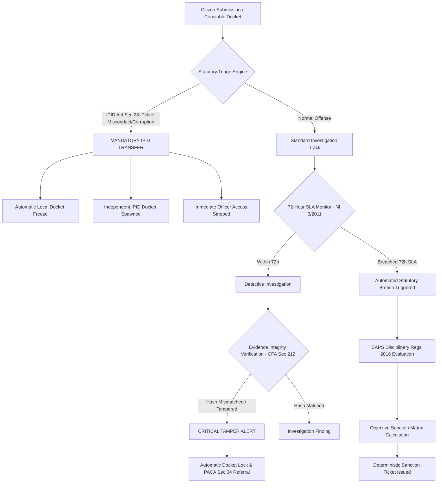
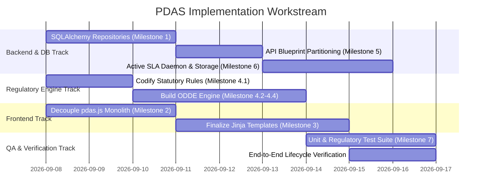

# Case Docket System (PDAS): Architectural Roadmap & Implementation Blueprint

## Executive Summary

The **Police Docket Accountability System (PDAS)** is designed to transform police docket administration in South Africa. In conventional systems, docket management is vulnerable to human discretion, delays, lost dockets, and subjective disciplinary oversight. 

This document provides a comprehensive technical audit, architectural refactoring blueprint, and phased task breakdown for developing PDAS into a fully functioning, tamper-evident, and objective case-docket platform. 

The primary objective is to **strip subjective discretion, arbitrary punishment, and discretionary inaction away from individual human actors** and place it squarely into an **objective, non-biased, deterministic regulatory engine** grounded in South African law, specifically:
- **South African Police Service (SAPS) Act 68 of 1995** & **SAPS Disciplinary Regulations (2016)**
- **Independent Police Investigative Directorate (IPID) Act 1 of 2011** (Section 28 Mandatory Reporting)
- **Criminal Procedure Act 51 of 1977 (CPA)** (Section 212 Evidence & Section 50 Timeframes)
- **Prevention and Combating of Corrupt Activities Act (PRECCA) 12 of 2004** (Section 34 Anti-Corruption Duty)
- **Promotion of Administrative Justice Act (PAJA) 3 of 2000** (Procedural Fairness & Objective Justification)
- **Constitution of the Republic of South Africa, 1996** (Section 33 Just Administrative Action & Section 205–208 Policing)

---

## 1. Current Codebase Audit: What Exists, What Is Missing & What Needs Connection

### 1.1 Summary of Existing Assets
The repository contains a foundational skeleton with domain engines and prototype UI routes:
- **17 Specialized Python Modules** in `app/modules/` (e.g., `regulatory_engine`, `compliance_engine`, `station_commander_engine`, `ipid_engine`, `freeze_engine`, `automation_engine`, `evidence_engine`, `discipline_engine`).
- **Complete SQLAlchemy Model Definitions** in `app/models.py` covering 17 entities (`CaseDocket`, `Assignment`, `Freeze`, `Escalation`, `AuditEvent`, `Interview`, `Recording`, `DisciplinaryCase`, `IntegrityEvent`, etc.).
- **Flask Application Factory & Dependency Container** in `app/__init__.py`.
- **15 Jinja2 Templates** in `app/templates/` corresponding to five role dashboards (Citizen, Constable, Detective, Station Commander, IPID).
- **Synthetic Test Identities** in `seed_data/test_citizens.py` across all roles.

---

### 1.2 Critical Architecture Deficits & Missing Connections

| Component | Current State | Deficit / Problem | Target State (Production Architecture) |
| :--- | :--- | :--- | :--- |
| **Frontend Scripting** | Single `app/static/js/pdas.js` file (719 lines). | **Monolith**: Contains auth, API clients, 10+ page hydration routines, event handlers, and modals. Single point of failure; impossible for team to divide work. `citizen_dashboard.js` is 0 bytes. | **ES6 Modular Directory**: Split into `core/api.js`, `core/auth.js`, `core/ui.js`, and role-specific modules (`citizen.js`, `constable.js`, `detective.js`, `station_commander.js`, `ipid.js`, `regulatory.js`). |
| **Backend API Routing** | Single `app/api/v1/routes.py` file (1,048 lines). | **Monolith**: All routes for 5 distinct roles + auth + health lumped in one file. Lacks separation of concerns. | **Sub-Blueprints**: Partition into `api/v1/auth_routes.py`, `citizen_routes.py`, `constable_routes.py`, `detective_routes.py`, `station_commander_routes.py`, `ipid_routes.py`, and `regulatory_routes.py`. |
| **Persistence Layer** | All repositories inherit from `InMemoryRepository` (`_shared_items = []`). | **Disconnected Persistence**: `models.py` models are defined but never queried or saved. Data resets on process restart. Multi-worker Gunicorn causes state corruption. SQLite DB (`case_docket_dev.db`) is bypassed. | **SQLAlchemy Repository Layer**: Implement concrete SQLAlchemy queries (`session.execute`, `session.commit()`) backed by SQLite/PostgreSQL with transactional consistency. |
| **Jinja Templates** | 15 templates with hardcoded IDs and unhooked buttons. | **Mocked / Incomplete UI**: `base.html` hardcodes `CAS-2023-BB1`. `station_commander_docket_detail.html` has hardcoded `<input value="Detective One">` with no button handler. `detective_case_workspace.html` has unhooked notes. `ipid_escalation_detail.html` decision buttons do not submit payloads. | **Dynamic Componentized Templates**: Reusable macros (`_docket_card.html`, `_timeline.html`, `_evidence_table.html`), dynamic modal triggers, error banners, and real form bindings. |
| **Objective Legal Engine** | `compliance_engine` and `regulatory_engine` only check basic roles and freezes. | **Subjective Human Discretion**: Humans still decide whether to uphold/dismiss escalations or reassign cases. No automated misconduct categorization or non-biased sanction calculation. | **Objective Deterministic Decision Engine (ODDE)**: Codified statutory rules from SAPS Disciplinary Regs 2016, IPID Act Sec 28, and CPA 1977 that deterministically evaluate cases and compute mandatory sanctions. |
| **Automated SLA Engine** | `AutomationService` is an empty callback registry (`self._jobs = []`). | **Passive / No Background Execution**: 72-hour SLA calculation exists on-demand, but nothing automatically triggers breaches, case freezes, or disciplinary referrals when time expires. | **Active Background SLA Guardian**: Celery / APScheduler worker or request-hook evaluation that continuously checks docket SLAs, auto-freezes delinquent cases, and generates disciplinary tickets. |
| **Evidence & Media** | `MediaManager` only parses paths; `EvidenceManagementService` is purely in-memory. | **Insecure Chain of Custody**: Files are not physically uploaded or hashed. Vulnerable to evidence tampering and fails CPA Section 212 requirements. | **Cryptographic Evidence Vault**: Secure filesystem/S3 upload, automatic SHA-256 integrity hashing, immutable chain-of-custody logging, and tamper-detection triggers. |
| **Automated Testing** | `tests/` contains 0 tests (`conftest.py` only). | **Zero Verification**: No automated tests exist to verify routes, authorization, state transitions, or legal compliance. | **Comprehensive Test Suite**: Pytest coverage for domain engines, repository persistence, statutory rule evaluation, and API integration. |

---

## 2. South African Regulatory Architecture: The Objective Decision Engine

To achieve the goal of **taking the ability to determine accountability, punishment, and what needs to be done away from users and into an objective, non-biased system**, PDAS must encode South African statutory mandates as deterministic state machines.



### 2.1 Codified Statutes & Regulatory Rules

#### A. Independent Police Investigative Directorate (IPID) Act 1 of 2011
- **Section 28(1) Mandatory Referral Categories**:
  - `IPID.SEC28.DEATH_CUSTODY`: Any death in police custody.
  - `IPID.SEC28.DEATH_POLICE_ACTION`: Death as a result of police action.
  - `IPID.SEC28.FIREARM_DISCHARGE`: Discharge of an official firearm by any police officer.
  - `IPID.SEC28.RAPE_POLICE`: Rape by a police officer (on or off duty).
  - `IPID.SEC28.RAPE_CUSTODY`: Rape of any person in police custody.
  - `IPID.SEC28.TORTURE_ASSAULT`: Torture or assault committed by an officer.
  - `IPID.SEC28.CORRUPTION`: Corruption matters under PRECCA (Act 12 of 2004).
- **Objective System Action**:
  When a docket or escalation is categorized under any Section 28 clause:
  1. The system **automatically bypasses local station control**.
  2. Local docket mutation is **immediately frozen** (`source="IPID_STATUTORY_LOCK"`).
  3. The implicated officer’s access is **automatically revoked** in the Identity Registry.
  4. Station commanders **cannot dismiss or override** the referral.

#### B. SAPS Disciplinary Regulations (2016) – Objective Sanction Matrix
Disciplinary sanctions must not be subject to station commander favoritism or officer intimidation. The system evaluates the offense, historical infractions, and evidence integrity against a statutory decision matrix:

| Misconduct Tier | Statutory Definition (SAPS Disciplinary Regs 2016) | Objective Aggravating Factors | Mandatory Non-Biased System Sanction |
| :--- | :--- | :--- | :--- |
| **Tier 1: Minor Misconduct** | Failure to record non-critical administrative notes, minor procedural delays (<24h). | First offense; no evidence impact. | **Level 1 Sanction**: Automated Corrective Counseling & Warning recorded on Officer Audit File. |
| **Tier 2: Serious Misconduct** | SLA Breach (>72h inaction under NI 3/2011), failure to safeguard evidence chain, repeated minor infractions. | Prior Tier 1 on record within 6 months. | **Level 2/3 Sanction**: Automated Written Warning / Final Written Warning + Mandatory Docket Reassignment. |
| **Tier 3: Gross Misconduct** | Docket tampering (hash mismatch), extortion, bribery, assault, defeating the ends of justice. | Statutory breach under PRECCA Sec 34 / IPID Sec 28. | **Level 4/5 Sanction**: Immediate Automated Precautionary Suspension + IPID Referral + Disciplinary Hearing Initiation. |

#### C. Criminal Procedure Act 51 of 1977 & Constitution Section 35
- **CPA Section 212 & Electronic Communications and Transactions Act 25 of 2002**:
  - Every deposition, recording, and digital evidence item must have a cryptographic SHA-256 hash computed at moment of upload.
  - Any attempt to alter evidence triggers an `EVIDENCE.TAMPER` breach, freezes the docket, and generates an automated forensic incident.
- **Section 50(1) CPA (48-Hour Detention Rule)**:
  - If a suspect is detained under a docket, the system maintains a strict 48-hour countdown to first court appearance, triggering automated high-priority alerts to the station commander and detective at 24h, 36h, and 44h.

#### D. Promotion of Administrative Justice Act (PAJA) 3 of 2000
- **Section 3 (Procedural Fairness & Non-Bias)**:
  - *Nemo iudex in sua causa* (No one shall be a judge in their own cause): An officer cannot triage, investigate, or review a docket in which they are a witness, complainant, or implicated party.
  - Every administrative status change (freeze, unfreeze, reassignment) requires a recorded statutory justification linked to a legal reference ID.

---

## 3. Modular Separation of Concerns

To ensure future evolvability and allow team members to collaborate without Git merge conflicts, the codebase must be reorganized into distinct, decoupled architectural layers.

```
case_docket_system/
├── app/
│   ├── api/
│   │   └── v1/
│   │       ├── __init__.py                 <-- Registers sub-blueprints
│   │       ├── auth_routes.py              <-- /api/v1/auth/*
│   │       ├── citizen_routes.py           <-- /api/v1/citizen/*
│   │       ├── constable_routes.py         <-- /api/v1/constable/*
│   │       ├── detective_routes.py         <-- /api/v1/detective/*
│   │       ├── station_commander_routes.py <-- /api/v1/station-commander/*
│   │       ├── ipid_routes.py              <-- /api/v1/ipid/*
│   │       ├── regulatory_routes.py        <-- /api/v1/regulatory/*
│   │       └── evidence_routes.py          <-- /api/v1/evidence/*
│   ├── database/
│   │   ├── repositories/                   <-- Concrete SQLAlchemy Repositories
│   │   │   ├── base_repository.py          <-- BaseSqlAlchemyRepository
│   │   │   ├── case_repository.py          <-- CaseDocket queries
│   │   │   ├── assignment_repository.py
│   │   │   ├── audit_repository.py
│   │   │   ├── disciplinary_repository.py
│   │   │   ├── evidence_repository.py
│   │   │   └── freeze_repository.py
│   │   └── schemas/                        <-- Marshmallow serialization schemas
│   ├── modules/
│   │   ├── regulatory_engine/              <-- South African Statutory Rule Corpus
│   │   ├── decision_engine/                <-- Objective Non-Biased Determination Engine
│   │   ├── automation_engine/              <-- Active SLA Background Daemon
│   │   ├── evidence_engine/                <-- SHA-256 Vault & CPA Sec 212 Chain of Custody
│   │   ├── audit_engine/                   <-- Append-Only Immutable Audit Trail
│   │   └── [citizen|constable|detective|...]
│   ├── static/
│   │   ├── css/
│   │   │   └── pdas.css
│   │   └── js/
│   │       ├── core/
│   │       │   ├── api.js                  <-- Fetch client with JWT & error handling
│   │       │   ├── auth.js                 <-- Session, tokens & role guard
│   │       │   └── ui.js                   <-- Modals, toasts, status badges
│   │       ├── modules/
│   │       │   ├── citizen.js              <-- Wizard, dockets, timeline
│   │       │   ├── constable.js            <-- Triage, audio recorder, flag modal
│   │       │   ├── detective.js            <-- Workspace, findings, evidence viewer
│   │       │   ├── station_commander.js    <-- Oversight, SLA monitor, force reassign
│   │       │   ├── ipid.js                 <-- Escalations, statutory determinations
│   │       │   └── regulatory.js           <-- Legal rules & sanction matrix inspector
│   │       └── pdas_app.js                 <-- Clean entrypoint router
│   └── templates/
│       ├── base.html                       <-- Dynamic shell with clean modals
│       ├── components/                     <-- Reusable Jinja macros & partials
│       │   ├── _docket_card.html
│       │   ├── _timeline.html
│       │   ├── _evidence_table.html
│       │   ├── _reauth_modal.html
│       │   └── _statutory_badge.html
│       └── [role_views].html
```

---

## 4. Phased Task Breakdown & Implementation Roadmap

Tasks are partitioned into **7 Logical Milestones** with estimated engineering allocations so work can be divided across sprints or team members.

---

# Lazy_Case_Docket

## COMPLETED Milestone 1: Persistence Layer & SQLAlchemy ORM Connection

Goal: eliminate the in-memory mock repositories and give the app reliable,
transactional storage via SQLAlchemy + SQLite (swappable for Postgres via
`DATABASE_URL`).

### What changed

**Base repository contract** (`app/database/repositories/base_repository.py`)
Rewritten as `BaseSqlAlchemyRepository`: generic `get_by_id`, `list`/`list_all`,
`create`, `update`, `delete`, `paginate`, all backed by `db.session` with
commit-and-rollback-on-failure. Subclasses set `model` and, where the lookup
key isn't the surrogate PK, `id_column`.

**Domain repositories migrated to SQLAlchemy**
All 11 rewritten on top of the base class, against the tables in
`app/models.py`, preserving their exact old method signatures
(`list_for_case`, `get_current_assignment_for_case`, `end_assignment`, etc.)
so nothing in `app/modules/*/services.py` had to change: case, assignment,
freeze, escalation, disciplinary_case, flag, related_case, investigation,
investigation_finding, review_note, review_finding.

**Persistent, immutable audit trail**
New `AuditEventRepository` — append-only, `update()`/`delete()` raise
`ValueError` immediately. `AuditTrailService` takes an optional `repository`;
with one it persists to the DB, without one (default, used by ~10 other
service constructors) it falls back to the original in-memory list.

**Persistent identity service**
New `UserRepository`, keyed by `test_id`, with an idempotent
`seed_if_empty()`. `TestIdentityRegistry` takes an optional
`user_repository`; with one every lookup/mutation hits the DB, without one it
falls back to the original in-memory dicts built from `seed_data/test_citizens.py`.

**Migrations**
Root cause of the empty-migration problem: `app.models` was never imported
anywhere, so Alembic autogenerate saw no tables. Fixed by importing it in
`app/__init__.py`. Deleted the old empty stub migration and regenerated a
real initial migration — 17 tables plus `alembic_version`.

**App wiring** (`app/__init__.py`)
`create_app()` now calls `db.create_all()` and seeds identities inside
`app.app_context()`, and wires `identity_registry`/`audit_service` with real
repositories. Added an optional `database_uri` param for tests that need a
real on-disk SQLite file instead of `:memory:`.

### Tests

`tests/test_persistence.py` (new): CRUD round-trips for `CaseRepository`,
`AssignmentRepository`, and `AuditEventRepository`; audit immutability;
identity-seeding idempotency; and a restart-survival test — write through one
`create_app()` instance pointed at a real SQLite file, dispose its engine,
read the data back through a second instance. All passing, alongside the
full existing suite.

Also verified through a real HTTP test-client cycle (not just direct service
calls): login, the full citizen docket → statement → evidence → submit flow,
constable interview/recording/registration, and station commander
reassignment — re-fetching after each step to confirm it actually persisted.

---

## COMPLETED Milestone 2: Frontend Monolith Decoupling (`pdas.js` Refactoring)

Goal: break the 719-line `pdas.js` monolith into modular, maintainable ES6
modules with strict separation of concerns, without changing any observable
behavior.

- [x] **Task 2.1: Core API & HTTP Service (`core/api.js`)**
  - Created `app/static/js/core/api.js`.
  - `fetchJson(url, options)` with automatic JWT Bearer header injection (via `core/auth.js::getToken`), JSON body encoding, and standardized error surfacing from the response payload's `error` field.
- [x] **Task 2.2: Authentication & Session Manager (`core/auth.js`)**
  - Created `app/static/js/core/auth.js`.
  - `setSession`, `clearSession`, `getUser`, `getToken`, `isAuthenticated`, `requireRole`, `routeByRole`, plus `bindLoginForm`/`bindLogoutButton` (dependency-injectable for testing).
- [x] **Task 2.3: UI Helpers & Modal System (`core/ui.js`)**
  - Created `app/static/js/core/ui.js`.
  - `buildStatusBadge(status)`, `setEmptyState`, `bindCaseLinks`, `refreshUserBadge`, and `bindReauthModal` (open/close wiring for the high-accountability re-auth modal).
- [x] **Task 2.4: Domain Module Split**
  - `app/static/js/modules/citizen.js`, `constable.js`, `detective.js`, `station_commander.js`, `ipid.js` — each owns exactly the hydration/handlers for its role's dashboard + detail page, ported behavior-for-behavior from the old monolith.
  - `app/static/js/modules/shared.js` — added for the two cross-role widgets (`activeCaseList`, `evidenceVaultList`) that render on pages reachable by more than one role and aren't gated by `data-role`.
- [x] **Task 2.5: Application Entrypoint (`pdas_app.js`)**
  - `app/static/js/pdas_app.js`: binds login/logout, dynamically `import()`s only the role module matching `document.body.dataset.role`, then loads the shared module.
  - `base.html` now loads `<script type="module" src=".../pdas_app.js">`; the old `pdas.js` and the dead 0-byte `citizen_dashboard.js` were deleted.

### Tests

**Frontend (Vitest + jsdom, new toolchain — `package.json`, `vitest.config.js`):**
72 tests across 10 files under `app/static/js/tests/`:
- *Unit* — `core.api.test.js`, `core.auth.test.js`, `core.ui.test.js` test each core module in isolation (auth/ui mocked out where they're a dependency of the unit under test): token injection, error-message extraction, status-badge mapping, cookie/localStorage fallback, malformed-cookie handling.
- *Integration* — one file per domain module (`modules.citizen.test.js`, `.constable.`, `.detective.`, `.station_commander.`, `.ipid.`, `.shared.`) exercising the real module wired to the real `core/api.js` + `core/ui.js` against a jsdom DOM, with only `fetch` mocked at the network boundary — dashboard rendering, detail hydration, form submission, button wiring (Continue to Interview, Start Investigation, case-card navigation), and role/element gating in `init()`.
- *System* — `system.pdas_app.test.js` boots the real entrypoint with **nothing mocked except `fetch`**: full login → session → role redirect through the real `auth.js`+`api.js`, a full citizen dashboard render with the Bearer token verified end-to-end from `localStorage` through the fetch call, and the reauth modal / user badge chrome.

**Backend system test (new — `tests/test_frontend_modularization.py`, pytest + Flask test client):**
Verifies the real running app, not just the JS in isolation — all 10 new module files are served by Flask's static route with a JS content-type, the old `pdas.js`/`citizen_dashboard.js` paths now 404, `base.html` emits the `type="module"` entrypoint tag (and never `js/pdas.js`) for the login page and for every one of the 5 role dashboards after a real login, the unauthenticated redirect still works, and the cross-role Active Cases page still renders for every non-citizen role.

Full suite still green: **101 tests total** — pytest: 28 passed, 1 skipped across 2 files (`test_persistence.py`, `test_frontend_modularization.py`); Vitest: 72 passed across 10 files. The Milestone 1 persistence tests were untouched by this refactor.

---

## COMPLETED Milestone 3: Template Finalization & Interactive UX Completion

Goal: fix broken, mocked, or hardcoded templates and make every button, input,
and modal fully operational, building directly on the SQLAlchemy persistence
layer (Milestone 1) and the ES6 module split (Milestone 2).

### A pre-existing bug found and fixed first

Before wiring anything up, `base.html` was audited against every child
template and turned out to have a structural bug that predates this
milestone: every child template does `` +
`...`, but `base.html`'s ``
wrapped the *entire* sidebar/topbar/footer shell and relied on
`{{ self.body() }}` inside it to splice in the child's markup. In Jinja,
a child's `` **replaces** the parent's block outright —
so the shell never rendered for any page, on any role, ever. Every
dashboard and detail page has been rendering as bare content with no
sidebar nav, topbar, or footer since the UI was first scaffolded; nothing
in the Milestone 1/2 test suites caught it because they only asserted on
`data-role` and the script tag, both of which sit outside the block. Fixed
by moving the shell markup outside `` so it always
renders, with the block left as a normal, empty slot child templates fill
in exactly as before (zero child-template changes required) and a
`self.content()` call so the unauthenticated `plain-layout` branch (login
page) still gets the same content. Verified via direct HTML inspection
(`pdas-shell`/`nav-list`/`content-wrap` now present) and the full pytest run.

Also found and fixed while auditing role wiring: `/active-cases` and
`/evidence-vault` in `app/ui/routes.py` hardcoded `role="station_commander"`
regardless of who was actually logged in, so a constable/detective/IPID
user landed on those two pages with the station commander's sidebar menu.
Fixed to pass the real role from the session claims.

### What changed

**`base.html`** — reauth modal hardcoded to `CAS-2023-BB1` / "Authorize
Escalation Decision" is now populated via `data-reauth-target`,
`data-reauth-action`, `data-reauth-subtitle`, `data-reauth-reason`,
`data-reauth-confirm`, and `data-reauth-error` hooks, driven per-action by
`core/ui.js::configureReauthModal(...)`. Nav items now compute their
`active` class from `request.path` (Jinja has `request` in context by
default; no route changes needed) instead of the first sidebar link always
being marked active. The redundant citizen "My Dockets" link (pointed at
the same URL as "Dashboard") was dropped.

**`app/templates/components/`** — four Jinja macros, adapted to the reality
that M2 made every page's actual data fully JS-hydrated (Flask's UI routes
render a shell, not case data — there's nothing for a macro to loop over
server-side). Rather than force macros to fake server-side rendering they
can't do, each renders the shared **initial-paint skeleton** that JS then
replaces once its fetch resolves, so every dashboard/detail page gets
identical loading-state markup instead of each template hand-rolling its
own (or, for the dashboards, no loading state at all):
- `_docket_card.html::docket_list_skeleton(container_id, container_class, message)`
- `_timeline.html::timeline_skeleton(list_id, message)`
- `_evidence_table.html::evidence_table_skeleton(body_id, message)` — a real `<table>` (Item/Type/Source/Status/SHA-256 Hash columns; hashing itself is Milestone 6)
- `_statutory_badge.html::statutory_badge(citation, label)` — genuinely used inline (not just skeleton) next to legal citations, e.g. "IPID Act §28", "NI 3/2011", "CPA §212", "PAJA §3"

The equivalent duplication that actually lived in JS (every dashboard
module hand-rolling the same docket-card HTML string) was factored into
shared render helpers in `core/ui.js` instead — the honest fix for
client-rendered duplication: `renderDocketCard`/`renderDocketCardList`,
`renderTimelineList`, `renderEvidenceTable`, `populateSelect`, and
`renderSlaMeter` (a live 72-hour countdown/progress meter). All five
domain JS modules (`citizen.js` untouched, `constable`, `detective`,
`station_commander`, `ipid`, `shared`) now render through these instead of
duplicating template literals.

**Constable review** (`constable_docket_review.html` + `modules/constable.js`)
— "Potential Invalidity" is now a real flag list from
`GET .../dockets/<ref>/flags`, each with an "Update Flag" button. "Flag
Concern" opens a dedicated create/edit modal (category + status + notes)
posting to `POST/PATCH .../flags`. The citizen statement box and evidence
table render real fetched data instead of static placeholder text.

**Detective workspace** (`detective_case_workspace.html` + `modules/detective.js`)
— "Save Note" now persists via a **new** `PATCH
/api/v1/detective/investigations/<id>/notes` endpoint (didn't exist before;
added `InvestigationService.update_notes()`). "Add Finding" opens a modal
(finding type + notes) posting to the existing findings endpoint and
re-renders a findings list. Both controls are disabled until an
investigation actually exists for the docket — `get_docket_for_detective()`
now also returns the case's current investigation (id/status/notes) so the
workspace can tell without a second round trip.

**Station Commander detail** (`station_commander_docket_detail.html` +
`modules/station_commander.js`) — "Detective One"/"Detective Two" hardcoded
inputs replaced with a real officer `<select>`, populated from a **new**
`GET /api/v1/station-commander/officers` endpoint (`?role=constable|detective`
filter; added `StationCommanderService.list_officers()`, backed by the
identity registry's already-existing `list_constables()`/`list_detectives()`
from Milestone 1). "Confirm Reassignment" posts to the existing
force-reassign endpoint and is disabled with an explanation when the docket
is frozen or unregistered. The 72-hour SLA countdown renders from the
`sla` block the station commander service already computed
(`elapsed_hours`/`remaining_hours`/`sla_due_at`) — no backend change needed,
just a client-side meter that ticks every minute. The dashboard's duplicate,
non-functional "Assignment Controls" mini-form (same hardcoded "Detective
One" input, no case context to act on, no submit handler) was removed in
favor of pointing users at a specific docket's own reassignment panel; same
treatment for the IPID dashboard's dead Dismiss/Uphold buttons.

**IPID escalation detail** (`ipid_escalation_detail.html` + `modules/ipid.js`)
— now hydrates from `GET .../review-workspace` (an existing, richer
endpoint the page wasn't using) instead of the bare detail endpoint,
surfacing real Assignment & Freeze metadata and internal review findings
that were previously static placeholder text. Opening the page
auto-transitions an `OPEN` escalation to `UNDER_REVIEW` (required before a
decision can be recorded). Dismiss/Uphold both open the now-parameterized
reauth modal with a mandatory reason field — the 400-if-missing reason
requirement already existed server-side; this milestone is what actually
puts a UI in front of it. Both buttons disable with an explanation once
the escalation is already resolved.

### Tests

**Backend (pytest, new — `tests/test_milestone3.py`, 21 tests):** the two
new endpoints (notes update: success/persistence, empty-notes rejection,
role forbidden, 404; officer listing: default/filtered/invalid-role/
forbidden); the `/active-cases` and `/evidence-vault` role-bug regression
across all four applicable roles; and full-stack renders (real Flask +
Jinja, not just JS) of all four reworked detail pages plus a nav
active-state assertion — each built on a real citizen→constable→detective
HTTP lifecycle through to a `REGISTERED` docket, the same real-flow style
Milestone 1 used.

**Frontend (Vitest, updated):** `core.ui.test.js` gained coverage for every
new shared helper (`configureReauthModal` + `bindReauthModal` confirm
wiring, `renderDocketCardList`, `renderTimelineList`, `renderEvidenceTable`,
`populateSelect`, `renderSlaMeter`). `modules.constable.test.js`,
`modules.detective.test.js`, `modules.station_commander.test.js`, and
`modules.ipid.test.js` were rewritten against the real new markup/endpoints
(multi-URL fetch mocks per module instead of one blanket mock), including a
dedicated test driving the flag-create modal end-to-end and a
detective-workspace test covering both the no-investigation-yet and
investigation-already-open states.

Also untracked the 53 stray `__pycache__/*.pyc` files that had been
committed before `.gitignore` existed (flagged during the Milestone 1/2
audit, fixed here since this milestone's commit was already touching most
of the surrounding files).

Full suite green: **133 tests total** — pytest: 49 passed, 1 skipped across
3 files (`test_persistence.py`, `test_frontend_modularization.py`,
`test_milestone3.py`); Vitest: 84 passed across 10 files.

### Post-M3 fixes and load-bearing invariants

Three follow-up rounds of manual testing (by the repo owner) each found
real, working-app bugs that the milestone's own "133 tests green" state
didn't catch — commits `95e2280`, `0f6437c`, and `a381610` on `avinash`.
Recorded here because several of the fixes changed a rule other code now
silently depends on; the next person touching these areas needs to know the
rule exists, not just that a bug was once fixed.

**1. The citizen docket lifecycle was previously a dead end.**
`citizen_docket_detail.html` had never had statement/evidence/submit wiring
or a working "Escalate Case" button (pre-dates M3 — M3 only touched
constable/detective/station-commander/ipid pages). Since `submit_docket()`
requires at least one statement, no docket could ever leave `DRAFT` through
the UI. Fixed in `95e2280`: full statement save/update, evidence add, a
submit button gated on `status == DRAFT` and having a statement, and a
working escalation modal.
> **Invariant:** `CitizenDocketService._assert_draft()` / `_assert_evidence_editable()`
> gate what a citizen can mutate by `docket.status`. Any new citizen-facing
> control must check the same status before rendering as enabled, the way
> `citizen.js::hydrateCitizenDetail()` does — otherwise it'll either silently
> 400 or (worse) look enabled while doing nothing.

**2. "Continue to Interview" started an interview but nothing else existed.**
Neither the constable nor citizen page had any UI to submit a recording or
register the docket, so the interview step was a second, separate dead end
one click past the first. Fixed in `95e2280`: an interview panel on both
pages (status, recording submission, Register Docket once both sides are
in).
> **Invariant:** registering a docket flips its status to `REGISTERED`,
> and `ConstableRegistrationService.open_docket()` / `get_constable_docket()`
> explicitly reject anything that isn't `AWAITING_CONSTABLE_REGISTRATION` —
> so the constable's own docket-detail endpoint becomes inaccessible to them
> the instant they register it. `registerDocketBtn`'s click handler
> redirects to `/constable` for exactly this reason; don't "fix" that
> redirect to go back to the docket detail page.

**3. Evidence and recordings were metadata-only text fields.**
Fixed in `0f6437c`: `MediaManager.save_upload()` streams a real multipart
file to `instance/uploads/<evidence|recordings>/<uuid>_<original filename>`,
hashing it with SHA-256 as it writes.
> **Invariants:**
> - The `storage_reference` returned by an upload (e.g.
>   `"evidence/3f2a..._window.jpg"`) is the only thing a caller should ever
>   persist or use to fetch the file back — never reconstruct a path by hand.
>   `GET /api/v1/media/<storage_reference>` serves it back through
>   `MediaManager.resolve_path()`, which validates the reference stays
>   inside `storage_root` (path-traversal guard) — a hand-built path would
>   bypass that check on the write side and simply 404 on the read side.
> - Any new endpoint that accepts a file must branch on
>   `request.files.get("file")` vs. JSON the way `add_docket_evidence()` /
>   `_recording_payload_from_request()` do, to keep the older JSON-only
>   (metadata-only) callers — and every existing test that uses them —
>   working.
> - `get_evidence_file` / `get_recording_file` scope citizens to files on
>   their *own* dockets/interviews and let every operational role see any
>   file — matching the access model everywhere else in this app. Don't add
>   a third, differently-scoped file endpoint without a specific reason.

**4. Cross-role "Forbidden" on the detective dashboard and shared pages.**
`GET /api/v1/station-commander/dockets` — the list backing the detective
dashboard's "Current Investigations" panel *and* the shared Active Cases /
Evidence Vault pages (`shared.js`, reachable by constable/detective/
station_commander/ipid) — was gated to `station_commander` only since
Milestone 2. Fixed in `0f6437c` by introducing `OPERATIONAL_ROLES =
{"constable", "detective", "station_commander", "ipid"}` in `routes.py`.
> **Invariant:** this endpoint's name is legacy (`/station-commander/...`)
> but its actual audience is now all four operational roles. Any new
> "list every docket" or similarly broad read endpoint should use
> `OPERATIONAL_ROLES` from the start rather than defaulting to
> `role != "station_commander"`, which is what caused this bug in the first
> place and is an easy pattern to copy-paste back in.

**5. Reassigning a case's officer didn't transfer investigation ownership.**
`AssignmentService.create_replacement_assignment()` only ever touched the
assignment record. `InvestigationService._assert_authorized_detective()`
checks `investigation.detective_id`, which was never updated — so a newly
assigned detective was denied access to an investigation the previous
detective had already opened, while the previous detective kept sole
access despite no longer being assigned. Fixed in `0f6437c` for
`StationCommanderService.force_reassign_docket()`, and in a same-day
follow-up for `IPIDReviewService.reassign_case_officer()` (**both** call
`create_replacement_assignment()` — the first fix only covered one of the
two call sites; the second was found by explicitly auditing for this exact
class of gap and confirmed by a test that spies on
`reassign_active_investigation()` rather than requiring a second seeded
detective identity).
> **Invariant:** every current and future call site of
> `AssignmentService.create_assignment()` / `create_replacement_assignment()`
> that can target a `detective` role must also call
> `InvestigationService.reassign_active_investigation(case_reference,
> new_officer_id, actor_id, reason=...)` when `assignment.officer_role ==
> "detective"`. It's a safe no-op when there's no open investigation or the
> detective didn't change (see the method's early return) — call it
> unconditionally rather than trying to detect "is this reassignment
> meaningful" yourself.

**6. A station commander couldn't assign a constable to an unregistered docket.**
`AssignmentService` required `case.status == "REGISTERED"` unconditionally,
which also meant the target-officer dropdown silently stayed on "Loading
officers…" forever for any docket that wasn't yet registered (the code
just skipped populating it, with no error and no explanation). Fixed by
adding `_assert_assignable_status()`: `REGISTERED` (any officer role, as
before) OR `AWAITING_CONSTABLE_REGISTRATION` **and** the target role is
specifically `constable`.
> **Invariant:** this check now runs *after* `_resolve_target_officer()`
> resolves the officer's role (order matters — the role has to be known
> before the status/role combination can be validated), in both
> `create_assignment()` and `create_replacement_assignment()`. If you add a
> third assignable-status rule, extend `_assert_assignable_status()` rather
> than re-adding a bare `status != "REGISTERED"` check somewhere else — the
> old bare check is exactly what caused this bug.

**7. An escalation vanished from the IPID queue the moment it was opened.**
Opening an escalation's detail page auto-transitions it `OPEN` →
`UNDER_REVIEW` (`ipid.js::hydrateIpidDetail()`, part of the original M3
work) — normal and intended. But `EscalationService.list_queue()`'s default
(unfiltered) view called `EscalationRepository.list_open()`, which only
ever returned `status == "OPEN"`. So the escalation disappeared from the
dashboard queue the instant a reviewer opened it, before any decision was
made — reported by the repo owner as GitHub issue #3. Fixed by adding
`list_unresolved()` (`OPEN` + `UNDER_REVIEW`) and using it as the default.
> **Invariant:** "the IPID queue" now means "not yet resolved," not "not yet
> opened." An escalation only leaves it once dismissed or upheld
> (`status == "RESOLVED"`). Don't reintroduce a `status == "OPEN"`-only
> default when touching this code path.

**8. Two dead controls found by a systematic audit, not a bug report.**
The constable dashboard's Search box had zero JS behind it, and the
detective workspace never displayed constable-raised flags or related-case
links despite the flag-creation modal's own copy promising "reviewed by the
assigned detective." Both fixed in `a381610`. Neither broke any existing
test because no test exercised those UI elements at all — the audit method
was cross-referencing every template's interactive-element `id` against
its module's `getElementById`/`querySelector` calls, and every route's role
check against every JS module's fetch calls. That audit surfaced five
further gaps that were *not* fixed (logged as GitHub issues #4-#8 instead —
missing UI for completing an investigation, viewing IPID disciplinary
cases, a consolidated SLA-breach view, a citizen's own escalation status,
and constable-side related-case creation). Worth re-running that same
cross-reference sweep after any future milestone before calling it done.

Full suite green after all of the above: **212 tests total** — pytest: 105
passed, 1 skipped; Vitest: 106 passed.

**9. All seven open GitHub issues (#2–#8) closed, plus an app-wide toast-feedback audit.**
Requested directly by the repo owner: fix every open issue, and specifically
check that mutating actions — escalations and docket registration above
all — give the user real feedback on success and failure. What shipped:

- **#8 — constable-side related-case creation.** The Related Cases panel
  (`constable_docket_review.html`) was read-only; added an inline
  target-reference + notes form wired to the existing
  `POST .../dockets/<ref>/related` endpoint (`constable.js::bindRelatedCaseForm`).
- **#7 — citizen visibility into their own escalations.**
  `CitizenDocketService.list_escalations()` returned a hand-built dict that
  silently dropped `decision`/`decision_reason`/`decision_at` — a citizen
  could escalate but never learn the outcome. Added those three fields, plus
  a new "My Escalations" panel on `citizen_docket_detail.html`.
- **#6 — station commander SLA-breach view.** New "SLA Breaches" panel on
  `station_commander_dashboard.html`, backed by the already-working
  `GET .../sla/breaches` endpoint; `buildStatusBadge()` in `core/ui.js` now
  recognizes `BREACHED` (there was already an unused `.badge-breach` CSS
  class waiting for exactly this).
- **#5 — IPID disciplinary case view.** New "Disciplinary Cases" list panel
  on `ipid_dashboard.html` plus a new read-only detail page/route
  (`/ipid/disciplinary-cases/<id>`), both backed by the already-working
  `GET /ipid/disciplinary-cases[/<id>]` endpoints that nothing in the UI
  had ever called.
- **#4 — detective "Complete Investigation" UI.** New modal
  (`#completeInvestigationModal`, mirrors the existing Add Finding modal)
  posting `{outcome, final_notes}` to the already-working
  `POST .../investigations/<id>/complete` endpoint.
- **#3 — IPID "take custody" of a docket under review.** Opening a review
  never froze the docket, so other officers could keep mutating a case
  IPID was actively reviewing (the "vanishes from the queue" half of this
  issue was already fixed — see item 7 above). Added
  `IPIDReviewService.take_custody()` / `POST .../escalations/<id>/take-custody`
  and a "Take Custody & Freeze Docket" button next to Dismiss/Uphold on
  `ipid_escalation_detail.html`, using the same reauth-modal pattern.
  > **Note on an approach that was tried and reverted:** the first attempt
  > wired freezing automatically into `start_review()` (open-for-review =
  > auto-freeze). That broke `test_uphold_creates_a_disciplinary_case...`
  > and its own live equivalent: `AssignmentService.create_replacement_assignment()`
  > hard-blocks *any* reassignment on a frozen case, including a station
  > commander assigning who's accountable for the escalation, which
  > realistically has to happen *during* the review window, not before it.
  > Freezing is therefore an explicit IPID action, not an automatic
  > side-effect of opening a review.
- **#2 — multiple investigation notes, evidence-linked, plus citizen
  visibility into "investigation opened".** Scoped down from the issue's
  broader ask to what's concretely useful: a new `investigation_notes`
  table (`InvestigationNote` model, `InvestigationNoteRepository`) supports
  many notes per investigation, each optionally tied to one evidence item
  (`evidence_reference`, validated against the case's own evidence list) —
  additive to, not a replacement for, the existing single-field working
  `notes` textarea. New `POST`/`GET .../investigations/<id>/note-entries`
  routes; a "Notes & Evidence Annotations" panel on
  `detective_case_workspace.html`. Separately, `InvestigationService.create_investigation()`
  now appends an `investigation_opened` entry to the *case's own* timeline
  (previously only logged to the investigation's internal timeline and the
  audit log under a different action name, `investigation_created`) — so it
  now surfaces automatically via the citizen's existing
  `GET .../dockets/<ref>/timeline` endpoint with no new route needed.
  > **New table, no migration needed:** `investigation_notes` is a brand
  > new table, so `db.create_all()` (called at every app startup) creates
  > it against the existing dev SQLite file with no `ALTER TABLE` required.
  > This only works because it's a *new table* — adding a column to an
  > existing table (e.g. `investigation_findings`) would need a real Alembic
  > migration, since `create_all()` never alters tables that already exist.
- **App-wide toast-feedback audit.** Every citizen/constable/detective/
  station-commander mutating action already showed a toast on both success
  and failure — not a bug. The real gaps, all on the IPID side:
  `configureReauthModal()`'s (`core/ui.js`) error handler only ever wrote
  the modal's own inline `data-reauth-error` text, never a toast — so
  Dismiss/Uphold/Take-Custody failures were easy to miss if the modal
  wasn't being watched closely. Fixed once, generically, in the shared
  handler, so it covers all three actions (and any future reauth-gated
  action) rather than patching each module separately. Also added a toast
  to `ipid.js`'s auto `OPEN → UNDER_REVIEW` transition (previously silent
  either way) and to the constable/detective Related Cases fetch-failure
  paths (previously inline-only, unlike every other fetch failure in the
  app).
- **Two more real bugs found via the mandatory manual walkthrough** (not
  bug reports — see the standing rule at the top of this section):
  1. `InvestigationService._get_investigation_by_case()` (used by
     `get_docket_for_detective()`) only ever returned an `OPEN`/`IN_PROGRESS`
     investigation — so the instant a detective completed one via the new
     #4 UI, the workspace reverted to "no investigation has been started,"
     hiding the findings/notes/outcome the completion flow exists to
     preserve. Fixed with a display-only `_get_latest_investigation_by_case()`
     (falls back to the most recent investigation regardless of status);
     `_get_investigation_by_case()` itself is untouched and still governs
     whether a *new* investigation may be opened. The frontend now also
     explicitly disables Add Finding / Add Note / Save Note / Complete
     Investigation once `investigation.status === 'COMPLETED'`
     (`detective.js`'s `mutableInvestigationId`), since simply surfacing the
     completed investigation would otherwise re-enable controls the backend
     correctly rejects.
  2. `IPIDReviewService.uphold_escalation()` resolved the escalation
     (`status → RESOLVED`, `decision → UPHELD`) and froze the docket
     *before* checking whether an officer was actually assigned to revoke.
     A case with an escalation but no active assignment (a realistic
     scenario — assignment can happen after review starts, see the #3 note
     above) hit the "no active officer assignment" `ValueError` *after*
     both of those mutations had already committed, leaving the docket
     permanently frozen and the escalation permanently
     RESOLVED/UPHELD-with-no-disciplinary-case — and no recovery path,
     since Dismiss requires `UNDER_REVIEW` and a second Uphold requires
     not-already-resolved. Found live in the browser, reproduced in
     `test_uphold_without_an_assigned_officer_fails_cleanly_without_resolving_or_freezing`.
     Fixed by moving every validation check (officer assignment, officer
     identity, freeze-ability) before any mutation.
  > **Invariant:** any multi-step "decision" method that mutates several
  > independent pieces of state (escalation status, freeze, officer access,
  > disciplinary case) must validate *everything* it needs up front and
  > mutate nothing until every precondition has already passed — there's no
  > transaction/rollback layer here to undo a partial failure. `dismiss_escalation()`
  > already followed this shape by luck (its only side effect, unfreezing,
  > is naturally idempotent-safe); `uphold_escalation()` didn't, and that's
  > exactly what broke.

Full suite green after all of the above: **235 tests total** — pytest: 112
passed, 1 skipped; Vitest: 122 passed. All seven GitHub issues closed.

**10. IPID "Cases in Custody" section, plus frozen-docket visibility for every other role.**
Direct follow-up request after item 9: an IPID reviewer had no dedicated
place to find every docket they'd taken custody of, and no non-IPID role
could see that a docket was frozen without triggering the 400 from trying
to mutate it.

- **Cases in Custody.** `FreezeRepository.list_active()` (new) →
  `FreezeService.list_active_freezes(source=...)` (new) →
  `IPIDReviewService.list_custody_cases()` (new) → `GET /ipid/custody-cases`
  → a new "Cases in Custody" panel on `ipid_dashboard.html`. Every custody
  freeze is escalation-scoped (both `take_custody()` and
  `uphold_escalation()` always set `related_escalation_id`), so each entry
  links to `/ipid/escalations/<escalation_id>` — the existing review
  workspace — rather than a new page. A freeze from an upheld escalation is
  deliberately never auto-released, so upheld cases stay listed here
  alongside ones still mid-review; `escalation_status`/`escalation_decision`
  in the response let the UI (or a future one) tell the two apart.
- **"Work on" the case, not just see it.** The review workspace
  (`ipid_escalation_detail.html` / `ipid.js::hydrateIpidDetail`) already
  fetched the citizen's statement, evidence, and case timeline as part of
  `case_context` (`IPIDReviewService._build_case_context`) but never
  rendered them — only metadata, assignment, review notes/findings, and
  audit history were shown. Added three panels (Citizen Statement,
  Evidence, Case Timeline) using the same `renderEvidenceTable`/
  `renderTimelineList` helpers every other role's detail page already uses,
  so IPID can actually read what happened before deciding, not just see
  who's assigned.
- **Frozen status visible to every non-IPID role.** Previously only
  `StationCommanderService._attach_current_assignment()` exposed
  `is_frozen`/`freeze_status`/`freeze_reason`; citizen, constable, and
  detective docket-detail responses didn't carry them at all. Added the
  same three fields to `InvestigationService.get_docket_for_detective()`
  and `ConstableRegistrationService.get_docket()` directly (both already
  build a fresh dict per call, so no risk to any write path), and a
  dedicated `CitizenDocketService.get_docket_with_freeze_status()` wrapper
  for the citizen route specifically — kept separate from `get_docket()`/
  `_get_case()`, which every citizen mutation method reuses, so a
  display-only field never has to flow anywhere near `update_case()`. Each
  of `citizen_docket_detail.html`, `constable_docket_review.html`, and
  `detective_case_workspace.html` got a hidden-until-frozen "Frozen — under
  IPID review: `<reason>`" badge next to the existing status badge. The
  shared docket-card renderer (`core/ui.js::renderDocketCard`, used by the
  detective dashboard and the shared Active Cases / Evidence Vault pages)
  now also shows a small `FROZEN` badge per card when `item.is_frozen` is
  true — that list already carried the field via
  `StationCommanderService.list_dockets()`, it just wasn't drawn.
  > **Invariant found while wiring this up:** `GET /constable/dockets/<ref>`
  > (`ConstableRegistrationService.get_docket`) is only reachable while a
  > case is `AWAITING_CONSTABLE_REGISTRATION` — pre-existing, documented in
  > item 2 of this section — and `freeze_case()` requires `REGISTERED`. The
  > two states never overlap, so a constable can never actually view a
  > frozen case through their own per-docket route; the field was added
  > there anyway for consistency with the other three engines, but the
  > *reachable* surface for constable-visible freeze status is the shared
  > Active Cases / Evidence Vault list, not that route. Don't write a test
  > (or build a feature) that assumes a constable can open a REGISTERED
  > docket's own detail page — they can't, by design.

Full suite green after all of the above: **244 tests total** — pytest: 117
passed, 1 skipped; Vitest: 127 passed.

**11. "Case Frozen" blocking screen, cross-role victim statements, and constable-assignment access — direct follow-up requests.**

- **Frozen dockets are now blocked, not just flagged, for detective/
  constable/station commander.** Item 10 gave these three roles a badge
  alongside full case content while frozen; this request changed that to
  withholding the content entirely. `InvestigationService.get_docket_for_detective()`,
  `ConstableRegistrationService.get_docket()`, and a new
  `StationCommanderService.get_docket_detail()` (kept separate from
  `get_docket()`, which `force_reassign_docket()` and the audit/assignment
  sub-routes still need unrestricted, and which the oversight *list*
  continues to use so a frozen case still shows there with its FROZEN
  badge) now return a minimal `{case_reference, status, is_frozen,
  freeze_status, freeze_reason, frozen_at, frozen_by}` payload instead of
  statements/evidence/timeline/investigation/SLA/assignment detail once
  frozen. Each of `detective_case_workspace.html`,
  `constable_docket_review.html`, and `station_commander_docket_detail.html`
  wraps its real content in a `#xDocketContent` div and adds a sibling
  `#xFrozenNotice` "🔒 Case Frozen" panel; the JS hydrators check
  `docket.is_frozen` immediately after the first fetch and, if true, show
  the notice and `return` before any of the further findings/flags/related/
  audit/SLA/reassignment fetches that the minimal payload can't support
  anyway. IPID is deliberately exempt — the review workspace (item 10) is
  how they're meant to keep working a case they've taken into custody.
- **Detective and IPID can add victim/witness statements to the case
  docket, visible everywhere `docket.statements` is already read.** New
  `InvestigationService.add_statement()` (`POST /detective/dockets/<ref>/statements`,
  requires REGISTERED + not frozen, same gating as every other detective
  mutation) and `IPIDReviewService.add_case_statement()`
  (`POST /ipid/dockets/<ref>/statements`, case-reference-scoped like the
  pre-existing `reassign_case_officer`) both append to the same
  `case["statements"]` list the citizen's own statement already lives in,
  tagged with `recorded_by`/`recorded_by_role` so the UI can distinguish
  authors. **IPID's add deliberately does not check freeze** — IPID is the
  actor who freezes a docket via take-custody/uphold and needs to keep
  recording statements on a case under their own custody, not be locked
  out of it. A new shared `renderStatementList()` (`core/ui.js`) replaced
  four separate "show only `statements[statements.length - 1]`"
  implementations (citizen, constable, detective, IPID) with one list
  renderer showing every statement; the detective and IPID pages each
  gained a "Statements" panel with an "Add Victim Statement" modal
  following the same pattern as every other modal in the app.
  > **Bug caught by this refactor, not by a report:** the citizen page used
  > to seed its *own* editable statement textarea from
  > `statements[statements.length - 1]` — safe when only the citizen could
  > ever add one, broken the moment a detective's statement could be the
  > most recent entry (their text would silently appear in the citizen's
  > "editable" box, and saving it would have overwritten it as if the
  > citizen had written it). Fixed by filtering to
  > `!statement.recorded_by_role` (only the citizen's own additions lack
  > that field) before taking "the latest," independent of what's shown in
  > the new full-history panel.
- **Verified, and fixed, the station-commander-assigns-an-unregistered-
  docket flow end to end.** The backend rule itself
  (`AssignmentService._assert_assignable_status`) was already correct from
  a prior session (`AWAITING_CONSTABLE_REGISTRATION` + target role
  `constable` is assignable) — confirmed via a new pytest that assigns,
  then has that exact constable complete the interview and register the
  docket, start to finish. What *wasn't* there: since `REGISTERED` also
  accepts assignment of **any** officer role (not just constable, e.g. a
  station commander adding a constable to assist a detective's REGISTERED
  case), that constable had no way to ever open it — `ConstableRegistrationService.open_docket()`
  hard-required `AWAITING_CONSTABLE_REGISTRATION` and rejected anything
  else outright. Fixed by giving `open_docket()` a second path: a
  `REGISTERED` docket is now also openable by whichever constable is
  currently the assigned officer for it (checked via the newly-wired
  `assignment_service`, added to `ConstableRegistrationService`'s
  constructor and set post-construction in `app/__init__.py`, same pattern
  as `freeze_service`). The original open-queue behavior (any constable,
  pre-registration only) is untouched; an unassigned constable still gets
  rejected from a `REGISTERED` docket.

Full suite green after all of the above: **272 tests total** — pytest: 127
passed, 1 skipped; Vitest: 133 passed.

---

## COMPLETED Milestone 4: Objective South African Regulatory & Decision Engine (ODDE)

Assignee / contributor: **Yashay** (Developer B: regulatory and backend logic).
Branch: `yashay-m4-decision-engine`.

**4.1 Corpus.** `app/modules/regulatory_engine/corpus.py` holds the pure-data
codification: IPID Act s28(1)(a)-(h) categories, PRECCA s34, SAPS NI 3/2011
72-hour windows, and the SAPS Discipline Regulations 2016 misconduct schedule
and sanction matrix. Each is registered as a rule (`IPID.S28.*`,
`PRECCA.S34.REPORTING_DUTY`, `SAPS.NI3_2011.*`, `SAPS.DISCIPLINE.*`,
`CASE.CONFLICT_OF_INTEREST`) linked to new entries in the legal catalogue.
The Discipline Regulations and NI 3/2011 content is a **prototype
codification** and is flagged `verification_status` in the catalogue; confirm
against the gazetted text before production use.

**4.2 ODDE.** `app/modules/decision_engine/` (`triage`, `sla`, `tiering`,
`service`) are deterministic functions over the corpus: sentence-level
police-actor + offence detection with negation handling, SLA windows with
frozen-time exclusion, tiering with objective aggravators, and a sanction
matrix by tier and prior history in a 24-month window. Departing from the
mandatory sanction needs a written justification (`POST
/ipid/disciplinary-cases/<id>/close`).

**4.3 Referral and freeze.** Docket submission, citizen escalations and
constable flags are screened. A hit creates (or extends) an escalation with
source `IPID_STATUTORY_MANDATE`, freezes the docket (allowed before
registration), suspends the implicated assignee's permissions (reversible on
dismissal) and writes audit records citing IPID Act s28(1).

**4.4 Conflict of interest.** `ConflictOfInterestService` matches complainant,
implicated officer and assignee; assignment, opening a docket and opening an
investigation are rejected on a conflict (complainant is officer, implicated
officer, open disciplinary case, prior complaint, declared conflict). Officers
can declare conflicts (`/conflicts/declarations`).

**API additions:** `/regulatory/*`, `/decision/*`, `/conflicts/*`.

**Migration:** `flask db upgrade` is required on existing databases
(`c4d8e1f0a7b2`).

**Tests:** `tests/test_decision_engine.py` (unit) and
`tests/test_milestone4.py` (API/integration). Existing tests that used bribery
wording as neutral filler now use neutral text, since that wording now
(correctly) triggers a statutory referral.

---

### Milestone 4: Objective South African Regulatory & Decision Engine (ODDE) -- COMPLETED (assignee: Yashay, Developer B)
*Goal: Eliminate human bias by automating accountability, misconduct tiering, and statutory sanctions.*

- [x] **Task 4.1: Expand Regulatory Rule Corpus (`app/modules/regulatory_engine/`)**
  - Codify full rule set for IPID Act Section 28 (Mandatory referral categories).
  - Codify SAPS Disciplinary Regulations 2016 (Schedule 1: Misconduct definitions & sanction matrix).
  - Codify SAPS National Instruction 3/2011 (72-hour docket inspection and registration window).
  - Codify Prevention and Combating of Corrupt Activities Act (PRECCA) Section 34 reporting duties.
- [x] **Task 4.2: Build the Objective Deterministic Decision Engine (ODDE)**
  - Create `app/modules/decision_engine/service.py`:
    - `evaluate_statutory_triage(docket_data)`: Inspects incident descriptions and categories for Section 28 keywords/flags.
    - `evaluate_sla_compliance(case_reference)`: Evaluates delay intervals against statutory thresholds.
    - `calculate_misconduct_tier(officer_id, infraction_type, evidence_context)`: Determines Tier 1, 2, or 3 misconduct.
    - `determine_mandatory_sanction(officer_id, misconduct_tier)`: Queries past officer disciplinary history and calculates mandatory, non-biased sanction (Warning, Final Warning, Suspension, Dismissal).
- [x] **Task 4.3: Automated Referral & Freeze Automation**
  - If a citizen or constable logs an allegation of corruption, assault, or firearm discharge:
    - ODDE automatically generates an IPID Escalation ticket.
    - Automatically executes `freeze_service.freeze_case(..., source="IPID_STATUTORY_MANDATE")`.
    - Automatically strips local assigned officer write permissions.
    - Logs immutable audit record citing IPID Act Sec 28(1).
- [x] **Task 4.4: Enforce Separation of Duties & Conflict of Interest (PAJA Sec 3)**
  - Implement automated identity matching between Complainant, Accused/Implicated Officer, and Assignee.
  - Reject docket assignment if assignee has an active disciplinary case or interpersonal conflict.

---

### Milestone 5: Backend API Modularization (`api/v1/routes.py` Split)
*Goal: Break down the 1,048-line routing monolith into clean, testable sub-blueprints.*

- [ ] **Task 5.1: Create Sub-Blueprint Architecture**
  - Create `app/api/v1/auth_routes.py` (Login, user profile, token claims).
  - Create `app/api/v1/citizen_routes.py` (Docket creation, statement management, citizen timeline).
  - Create `app/api/v1/constable_routes.py` (Triage queue, flags, interview registration, recordings).
  - Create `app/api/v1/detective_routes.py` (Investigations, evidence inspection, findings).
  - Create `app/api/v1/station_commander_routes.py` (Oversight, reassignment, SLA breaches).
  - Create `app/api/v1/ipid_routes.py` (Escalation queue, review findings, statutory determinations).
  - Create `app/api/v1/regulatory_routes.py` (Public rules, sanction matrix, legal references).
  - Create `app/api/v1/evidence_routes.py` (Upload, download, hash verification).
- [ ] **Task 5.2: Register Sub-Blueprints in `app/api/v1/__init__.py`**
  - Mount all blueprints onto `api_v1_bp`.
  - Standardize error handler responses across all routes using Flask error decorators.

---

### Milestone 6: Tamper-Evident Evidence Vault & Active SLA Daemon
*Goal: Ensure cryptographic chain-of-custody for evidence and automated background enforcement of statutory SLAs.*

- [ ] **Task 6.1: Physical File Upload & Cryptographic Hashing**
  - Update `MediaManager` to stream uploaded multipart files to disk/storage root.
  - Compute SHA-256 content hash during upload.
  - Store hash and chain of custody in `evidence_index` and `CaseDocket.evidence`.
  - Implement CPA Section 212 verification endpoint (`GET /api/v1/evidence/<id>/verify-hash`).
- [ ] **Task 6.2: Audio Statement Ingestion & Storage**
  - Finalize constable and citizen interview audio recording upload.
  - Link citizen recording and constable recording side-by-side in `interviews` table.
- [ ] **Task 6.3: Active SLA Background Guardian Daemon**
  - Implement periodic runner (or request-lifecycle evaluation daemon) in `AutomationService`.
  - Check all active cases against the 72-hour registration/investigation deadline (SAPS NI 3/2011).
  - When a case breaches SLA:
    - Automatically mark status as `SLA_BREACHED`.
    - Automatically log disciplinary incident against assigned officer.
    - Escalate directly to Station Commander oversight queue.

---

### Milestone 7: Test Suite & Quality Assurance
*Goal: Achieve high test coverage across unit logic, regulatory rules, persistence, and API endpoints.*

- [ ] **Task 7.1: Unit Tests for Objective Decision Engine (`tests/unit/test_decision_engine.py`)**
  - Test Section 28 IPID triage rules.
  - Test Disciplinary Regulation 2016 sanction matrix calculations.
  - Test SLA calculation and breach detection logic.
- [ ] **Task 7.2: Repository & ORM Persistence Tests (`tests/integration/test_repositories.py`)**
  - Verify real database transactions, rollbacks, and data persistence in SQLite.
- [ ] **Task 7.3: API End-to-End Tests (`tests/e2e/`)**
  - `test_citizen_workflow.py`: Submit docket -> receive case reference -> verify timeline.
  - `test_constable_workflow.py`: Triage docket -> record interview -> register docket.
  - `test_detective_workflow.py`: Open investigation -> add finding -> complete investigation.
  - `test_ipid_statutory_transfer.py`: Report police corruption -> auto-freeze docket -> IPID review -> automated sanction.
- [ ] **Task 7.4: Static Code Analysis & Documentation**
  - Run `flake8` / `black` / `ruff` on the codebase.
  - Verify that all docstrings preserve South African legal citations.

---

## 5. Team Workload & Time Management Allocation

To effectively split work among developers, tasks can be assigned by functional tracks:



### Suggested Role Assignments:
1. **Developer A (Persistence & Architecture Lead)**:
   - Milestone 1 (SQLAlchemy ORM integration) & Milestone 5 (API Blueprint split).
   - Ensures data integrity, database schemas, and migration stability.
2. **Developer B (Regulatory & Backend Logic Engineer)**:
   - Milestone 4 (Objective Deterministic Decision Engine & Statutory Sanctions).
   - Milestone 6 (SLA Daemon & Evidence Vault).
   - Ensures strict legal compliance with SAPS Act, IPID Act, and CPA.
3. **Developer C (Frontend & UI/UX Specialist)**:
   - Milestone 2 (Decomposing `pdas.js` into ES6 modules).
   - Milestone 3 (Finalizing Jinja2 templates, macros, and dynamic modals).
   - Ensures responsive, accessible, and error-resilient client interfaces.
4. **Developer D (Quality Assurance & Test Automation)**:
   - Milestone 7 (Unit tests, integration tests, E2E regulatory flows).
   - Automated testing of edge cases (e.g., hash tampering, conflict-of-interest blocks).

---

## 6. Summary of Key Architectural Decisions

1. **Deterministic Rule Engine over AI/Human Discretion**:
   Decisions affecting police accountability, case freezes, and disciplinary sanctions must be code-driven algorithms evaluating codified statutes. This ensures 100% auditability and eliminates human bias.
2. **Decoupled ES Modules for Maintainability**:
   Replacing `pdas.js` with modular JavaScript files allows independent feature updates without regression risks on other roles.
3. **True ORM Persistence**:
   Moving from in-memory arrays to SQLAlchemy ORM models guarantees data durability, concurrent access safety, and production readiness.
4. **Tamper-Evident Evidence Chain**:
   Cryptographic SHA-256 verification ensures that electronic evidence complies with Section 212 of the Criminal Procedure Act.
