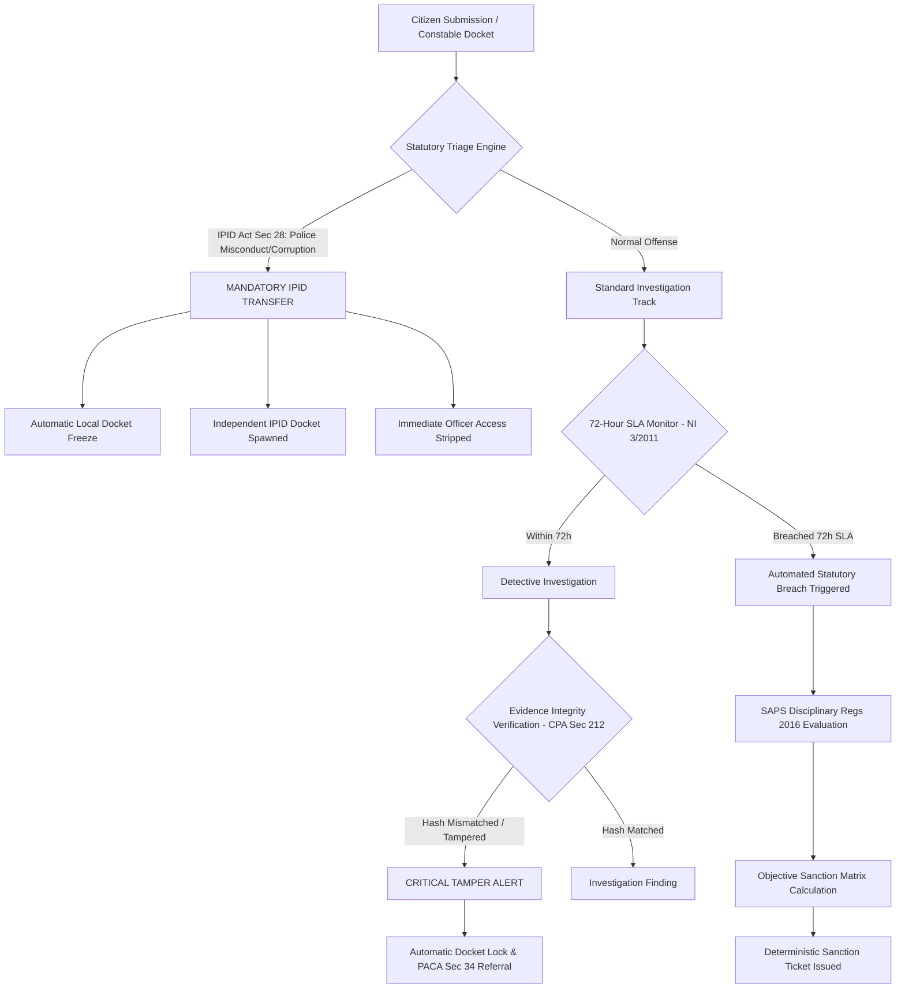
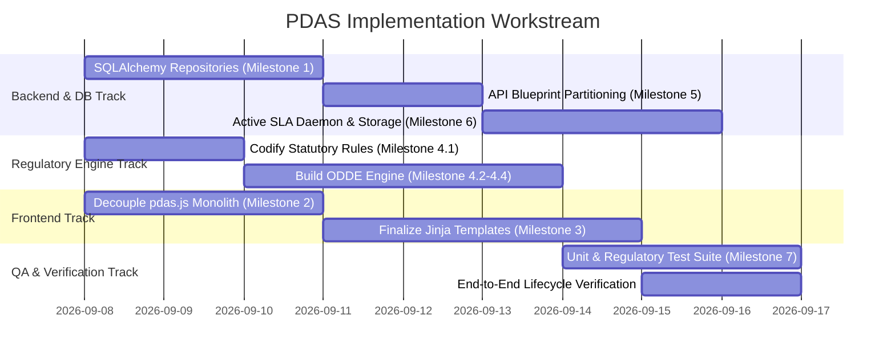

# Case Docket System (PDAS): Architectural Roadmap & Implementation Blueprint

## Executive Summary

The **Police Docket Accountability System (PDAS)** is designed to transform police docket administration in South Africa. In conventional systems, docket management is vulnerable to human discretion, delays, lost dockets, and subjective disciplinary oversight. 

This document provides a comprehensive technical audit, architectural refactoring blueprint, and phased task breakdown for developing PDAS into a fully functioning, tamper-evident, and objective case-docket platform. 

The primary objective is to **strip subjective discretion, arbitrary punishment, and discretionary inaction away from individual human actors** and place it squarely into an **objective, non-biased, deterministic regulatory engine** grounded in South African law, specifically:
- **South African Police Service (SAPS) Act 68 of 1995** & **SAPS Disciplinary Regulations (2016)**
- **Independent Police Investigative Directorate (IPID) Act 1 of 2011** (Section 28 Mandatory Reporting)
- **Criminal Procedure Act 51 of 1977 (CPA)** (Section 212 Evidence & Section 50 Timeframes)
- **Prevention and Combating of Corrupt Activities Act (PRECCA) 12 of 2004** (Section 34 Anti-Corruption Duty)
- **Promotion of Administrative Justice Act (PAJA) 3 of 2000** (Procedural Fairness & Objective Justification)
- **Constitution of the Republic of South Africa, 1996** (Section 33 Just Administrative Action & Section 205–208 Policing)

---

## 1. Current Codebase Audit: What Exists, What Is Missing & What Needs Connection

### 1.1 Summary of Existing Assets
The repository contains a foundational skeleton with domain engines and prototype UI routes:
- **17 Specialized Python Modules** in `app/modules/` (e.g., `regulatory_engine`, `compliance_engine`, `station_commander_engine`, `ipid_engine`, `freeze_engine`, `automation_engine`, `evidence_engine`, `discipline_engine`).
- **Complete SQLAlchemy Model Definitions** in `app/models.py` covering 17 entities (`CaseDocket`, `Assignment`, `Freeze`, `Escalation`, `AuditEvent`, `Interview`, `Recording`, `DisciplinaryCase`, `IntegrityEvent`, etc.).
- **Flask Application Factory & Dependency Container** in `app/__init__.py`.
- **15 Jinja2 Templates** in `app/templates/` corresponding to five role dashboards (Citizen, Constable, Detective, Station Commander, IPID).
- **Synthetic Test Identities** in `seed_data/test_citizens.py` across all roles.

---

### 1.2 Critical Architecture Deficits & Missing Connections

| Component | Current State | Deficit / Problem | Target State (Production Architecture) |
| :--- | :--- | :--- | :--- |
| **Frontend Scripting** | Single `app/static/js/pdas.js` file (719 lines). | **Monolith**: Contains auth, API clients, 10+ page hydration routines, event handlers, and modals. Single point of failure; impossible for team to divide work. `citizen_dashboard.js` is 0 bytes. | **ES6 Modular Directory**: Split into `core/api.js`, `core/auth.js`, `core/ui.js`, and role-specific modules (`citizen.js`, `constable.js`, `detective.js`, `station_commander.js`, `ipid.js`, `regulatory.js`). |
| **Backend API Routing** | Single `app/api/v1/routes.py` file (1,048 lines). | **Monolith**: All routes for 5 distinct roles + auth + health lumped in one file. Lacks separation of concerns. | **Sub-Blueprints**: Partition into `api/v1/auth_routes.py`, `citizen_routes.py`, `constable_routes.py`, `detective_routes.py`, `station_commander_routes.py`, `ipid_routes.py`, and `regulatory_routes.py`. |
| **Persistence Layer** | All repositories inherit from `InMemoryRepository` (`_shared_items = []`). | **Disconnected Persistence**: `models.py` models are defined but never queried or saved. Data resets on process restart. Multi-worker Gunicorn causes state corruption. SQLite DB (`case_docket_dev.db`) is bypassed. | **SQLAlchemy Repository Layer**: Implement concrete SQLAlchemy queries (`session.execute`, `session.commit()`) backed by SQLite/PostgreSQL with transactional consistency. |
| **Jinja Templates** | 15 templates with hardcoded IDs and unhooked buttons. | **Mocked / Incomplete UI**: `base.html` hardcodes `CAS-2023-BB1`. `station_commander_docket_detail.html` has hardcoded `<input value="Detective One">` with no button handler. `detective_case_workspace.html` has unhooked notes. `ipid_escalation_detail.html` decision buttons do not submit payloads. | **Dynamic Componentized Templates**: Reusable macros (`_docket_card.html`, `_timeline.html`, `_evidence_table.html`), dynamic modal triggers, error banners, and real form bindings. |
| **Objective Legal Engine** | `compliance_engine` and `regulatory_engine` only check basic roles and freezes. | **Subjective Human Discretion**: Humans still decide whether to uphold/dismiss escalations or reassign cases. No automated misconduct categorization or non-biased sanction calculation. | **Objective Deterministic Decision Engine (ODDE)**: Codified statutory rules from SAPS Disciplinary Regs 2016, IPID Act Sec 28, and CPA 1977 that deterministically evaluate cases and compute mandatory sanctions. |
| **Automated SLA Engine** | `AutomationService` is an empty callback registry (`self._jobs = []`). | **Passive / No Background Execution**: 72-hour SLA calculation exists on-demand, but nothing automatically triggers breaches, case freezes, or disciplinary referrals when time expires. | **Active Background SLA Guardian**: Celery / APScheduler worker or request-hook evaluation that continuously checks docket SLAs, auto-freezes delinquent cases, and generates disciplinary tickets. |
| **Evidence & Media** | `MediaManager` only parses paths; `EvidenceManagementService` is purely in-memory. | **Insecure Chain of Custody**: Files are not physically uploaded or hashed. Vulnerable to evidence tampering and fails CPA Section 212 requirements. | **Cryptographic Evidence Vault**: Secure filesystem/S3 upload, automatic SHA-256 integrity hashing, immutable chain-of-custody logging, and tamper-detection triggers. |
| **Automated Testing** | `tests/` contains 0 tests (`conftest.py` only). | **Zero Verification**: No automated tests exist to verify routes, authorization, state transitions, or legal compliance. | **Comprehensive Test Suite**: Pytest coverage for domain engines, repository persistence, statutory rule evaluation, and API integration. |

---

## 2. South African Regulatory Architecture: The Objective Decision Engine

To achieve the goal of **taking the ability to determine accountability, punishment, and what needs to be done away from users and into an objective, non-biased system**, PDAS must encode South African statutory mandates as deterministic state machines.



### 2.1 Codified Statutes & Regulatory Rules

#### A. Independent Police Investigative Directorate (IPID) Act 1 of 2011
- **Section 28(1) Mandatory Referral Categories**:
  - `IPID.SEC28.DEATH_CUSTODY`: Any death in police custody.
  - `IPID.SEC28.DEATH_POLICE_ACTION`: Death as a result of police action.
  - `IPID.SEC28.FIREARM_DISCHARGE`: Discharge of an official firearm by any police officer.
  - `IPID.SEC28.RAPE_POLICE`: Rape by a police officer (on or off duty).
  - `IPID.SEC28.RAPE_CUSTODY`: Rape of any person in police custody.
  - `IPID.SEC28.TORTURE_ASSAULT`: Torture or assault committed by an officer.
  - `IPID.SEC28.CORRUPTION`: Corruption matters under PRECCA (Act 12 of 2004).
- **Objective System Action**:
  When a docket or escalation is categorized under any Section 28 clause:
  1. The system **automatically bypasses local station control**.
  2. Local docket mutation is **immediately frozen** (`source="IPID_STATUTORY_LOCK"`).
  3. The implicated officer’s access is **automatically revoked** in the Identity Registry.
  4. Station commanders **cannot dismiss or override** the referral.

#### B. SAPS Disciplinary Regulations (2016) – Objective Sanction Matrix
Disciplinary sanctions must not be subject to station commander favoritism or officer intimidation. The system evaluates the offense, historical infractions, and evidence integrity against a statutory decision matrix:

| Misconduct Tier | Statutory Definition (SAPS Disciplinary Regs 2016) | Objective Aggravating Factors | Mandatory Non-Biased System Sanction |
| :--- | :--- | :--- | :--- |
| **Tier 1: Minor Misconduct** | Failure to record non-critical administrative notes, minor procedural delays (<24h). | First offense; no evidence impact. | **Level 1 Sanction**: Automated Corrective Counseling & Warning recorded on Officer Audit File. |
| **Tier 2: Serious Misconduct** | SLA Breach (>72h inaction under NI 3/2011), failure to safeguard evidence chain, repeated minor infractions. | Prior Tier 1 on record within 6 months. | **Level 2/3 Sanction**: Automated Written Warning / Final Written Warning + Mandatory Docket Reassignment. |
| **Tier 3: Gross Misconduct** | Docket tampering (hash mismatch), extortion, bribery, assault, defeating the ends of justice. | Statutory breach under PRECCA Sec 34 / IPID Sec 28. | **Level 4/5 Sanction**: Immediate Automated Precautionary Suspension + IPID Referral + Disciplinary Hearing Initiation. |

#### C. Criminal Procedure Act 51 of 1977 & Constitution Section 35
- **CPA Section 212 & Electronic Communications and Transactions Act 25 of 2002**:
  - Every deposition, recording, and digital evidence item must have a cryptographic SHA-256 hash computed at moment of upload.
  - Any attempt to alter evidence triggers an `EVIDENCE.TAMPER` breach, freezes the docket, and generates an automated forensic incident.
- **Section 50(1) CPA (48-Hour Detention Rule)**:
  - If a suspect is detained under a docket, the system maintains a strict 48-hour countdown to first court appearance, triggering automated high-priority alerts to the station commander and detective at 24h, 36h, and 44h.

#### D. Promotion of Administrative Justice Act (PAJA) 3 of 2000
- **Section 3 (Procedural Fairness & Non-Bias)**:
  - *Nemo iudex in sua causa* (No one shall be a judge in their own cause): An officer cannot triage, investigate, or review a docket in which they are a witness, complainant, or implicated party.
  - Every administrative status change (freeze, unfreeze, reassignment) requires a recorded statutory justification linked to a legal reference ID.

---

## 3. Modular Separation of Concerns

To ensure future evolvability and allow team members to collaborate without Git merge conflicts, the codebase must be reorganized into distinct, decoupled architectural layers.

```
case_docket_system/
├── app/
│   ├── api/
│   │   └── v1/
│   │       ├── __init__.py                 <-- Registers sub-blueprints
│   │       ├── auth_routes.py              <-- /api/v1/auth/*
│   │       ├── citizen_routes.py           <-- /api/v1/citizen/*
│   │       ├── constable_routes.py         <-- /api/v1/constable/*
│   │       ├── detective_routes.py         <-- /api/v1/detective/*
│   │       ├── station_commander_routes.py <-- /api/v1/station-commander/*
│   │       ├── ipid_routes.py              <-- /api/v1/ipid/*
│   │       ├── regulatory_routes.py        <-- /api/v1/regulatory/*
│   │       └── evidence_routes.py          <-- /api/v1/evidence/*
│   ├── database/
│   │   ├── repositories/                   <-- Concrete SQLAlchemy Repositories
│   │   │   ├── base_repository.py          <-- BaseSqlAlchemyRepository
│   │   │   ├── case_repository.py          <-- CaseDocket queries
│   │   │   ├── assignment_repository.py
│   │   │   ├── audit_repository.py
│   │   │   ├── disciplinary_repository.py
│   │   │   ├── evidence_repository.py
│   │   │   └── freeze_repository.py
│   │   └── schemas/                        <-- Marshmallow serialization schemas
│   ├── modules/
│   │   ├── regulatory_engine/              <-- South African Statutory Rule Corpus
│   │   ├── decision_engine/                <-- Objective Non-Biased Determination Engine
│   │   ├── automation_engine/              <-- Active SLA Background Daemon
│   │   ├── evidence_engine/                <-- SHA-256 Vault & CPA Sec 212 Chain of Custody
│   │   ├── audit_engine/                   <-- Append-Only Immutable Audit Trail
│   │   └── [citizen|constable|detective|...]
│   ├── static/
│   │   ├── css/
│   │   │   └── pdas.css
│   │   └── js/
│   │       ├── core/
│   │       │   ├── api.js                  <-- Fetch client with JWT & error handling
│   │       │   ├── auth.js                 <-- Session, tokens & role guard
│   │       │   └── ui.js                   <-- Modals, toasts, status badges
│   │       ├── modules/
│   │       │   ├── citizen.js              <-- Wizard, dockets, timeline
│   │       │   ├── constable.js            <-- Triage, audio recorder, flag modal
│   │       │   ├── detective.js            <-- Workspace, findings, evidence viewer
│   │       │   ├── station_commander.js    <-- Oversight, SLA monitor, force reassign
│   │       │   ├── ipid.js                 <-- Escalations, statutory determinations
│   │       │   └── regulatory.js           <-- Legal rules & sanction matrix inspector
│   │       └── pdas_app.js                 <-- Clean entrypoint router
│   └── templates/
│       ├── base.html                       <-- Dynamic shell with clean modals
│       ├── components/                     <-- Reusable Jinja macros & partials
│       │   ├── _docket_card.html
│       │   ├── _timeline.html
│       │   ├── _evidence_table.html
│       │   ├── _reauth_modal.html
│       │   └── _statutory_badge.html
│       └── [role_views].html
```

---

## 4. Phased Task Breakdown & Implementation Roadmap

Tasks are partitioned into **7 Logical Milestones** with estimated engineering allocations so work can be divided across sprints or team members.

---

# Lazy_Case_Docket

## COMPLETED Milestone 1: Persistence Layer & SQLAlchemy ORM Connection

Goal: eliminate the in-memory mock repositories and give the app reliable,
transactional storage via SQLAlchemy + SQLite (swappable for Postgres via
`DATABASE_URL`).

### What changed

**Base repository contract** (`app/database/repositories/base_repository.py`)
Rewritten as `BaseSqlAlchemyRepository`: generic `get_by_id`, `list`/`list_all`,
`create`, `update`, `delete`, `paginate`, all backed by `db.session` with
commit-and-rollback-on-failure. Subclasses set `model` and, where the lookup
key isn't the surrogate PK, `id_column`.

**Domain repositories migrated to SQLAlchemy**
All 11 rewritten on top of the base class, against the tables in
`app/models.py`, preserving their exact old method signatures
(`list_for_case`, `get_current_assignment_for_case`, `end_assignment`, etc.)
so nothing in `app/modules/*/services.py` had to change: case, assignment,
freeze, escalation, disciplinary_case, flag, related_case, investigation,
investigation_finding, review_note, review_finding.

**Persistent, immutable audit trail**
New `AuditEventRepository` — append-only, `update()`/`delete()` raise
`ValueError` immediately. `AuditTrailService` takes an optional `repository`;
with one it persists to the DB, without one (default, used by ~10 other
service constructors) it falls back to the original in-memory list.

**Persistent identity service**
New `UserRepository`, keyed by `test_id`, with an idempotent
`seed_if_empty()`. `TestIdentityRegistry` takes an optional
`user_repository`; with one every lookup/mutation hits the DB, without one it
falls back to the original in-memory dicts built from `seed_data/test_citizens.py`.

**Migrations**
Root cause of the empty-migration problem: `app.models` was never imported
anywhere, so Alembic autogenerate saw no tables. Fixed by importing it in
`app/__init__.py`. Deleted the old empty stub migration and regenerated a
real initial migration — 17 tables plus `alembic_version`.

**App wiring** (`app/__init__.py`)
`create_app()` now calls `db.create_all()` and seeds identities inside
`app.app_context()`, and wires `identity_registry`/`audit_service` with real
repositories. Added an optional `database_uri` param for tests that need a
real on-disk SQLite file instead of `:memory:`.

### Tests

`tests/test_persistence.py` (new): CRUD round-trips for `CaseRepository`,
`AssignmentRepository`, and `AuditEventRepository`; audit immutability;
identity-seeding idempotency; and a restart-survival test — write through one
`create_app()` instance pointed at a real SQLite file, dispose its engine,
read the data back through a second instance. All passing, alongside the
full existing suite.

Also verified through a real HTTP test-client cycle (not just direct service
calls): login, the full citizen docket → statement → evidence → submit flow,
constable interview/recording/registration, and station commander
reassignment — re-fetching after each step to confirm it actually persisted.

---

## COMPLETED Milestone 2: Frontend Monolith Decoupling (`pdas.js` Refactoring)

Goal: break the 719-line `pdas.js` monolith into modular, maintainable ES6
modules with strict separation of concerns, without changing any observable
behavior.

- [x] **Task 2.1: Core API & HTTP Service (`core/api.js`)**
  - Created `app/static/js/core/api.js`.
  - `fetchJson(url, options)` with automatic JWT Bearer header injection (via `core/auth.js::getToken`), JSON body encoding, and standardized error surfacing from the response payload's `error` field.
- [x] **Task 2.2: Authentication & Session Manager (`core/auth.js`)**
  - Created `app/static/js/core/auth.js`.
  - `setSession`, `clearSession`, `getUser`, `getToken`, `isAuthenticated`, `requireRole`, `routeByRole`, plus `bindLoginForm`/`bindLogoutButton` (dependency-injectable for testing).
- [x] **Task 2.3: UI Helpers & Modal System (`core/ui.js`)**
  - Created `app/static/js/core/ui.js`.
  - `buildStatusBadge(status)`, `setEmptyState`, `bindCaseLinks`, `refreshUserBadge`, and `bindReauthModal` (open/close wiring for the high-accountability re-auth modal).
- [x] **Task 2.4: Domain Module Split**
  - `app/static/js/modules/citizen.js`, `constable.js`, `detective.js`, `station_commander.js`, `ipid.js` — each owns exactly the hydration/handlers for its role's dashboard + detail page, ported behavior-for-behavior from the old monolith.
  - `app/static/js/modules/shared.js` — added for the two cross-role widgets (`activeCaseList`, `evidenceVaultList`) that render on pages reachable by more than one role and aren't gated by `data-role`.
- [x] **Task 2.5: Application Entrypoint (`pdas_app.js`)**
  - `app/static/js/pdas_app.js`: binds login/logout, dynamically `import()`s only the role module matching `document.body.dataset.role`, then loads the shared module.
  - `base.html` now loads `<script type="module" src=".../pdas_app.js">`; the old `pdas.js` and the dead 0-byte `citizen_dashboard.js` were deleted.

### Tests

**Frontend (Vitest + jsdom, new toolchain — `package.json`, `vitest.config.js`):**
72 tests across 10 files under `app/static/js/tests/`:
- *Unit* — `core.api.test.js`, `core.auth.test.js`, `core.ui.test.js` test each core module in isolation (auth/ui mocked out where they're a dependency of the unit under test): token injection, error-message extraction, status-badge mapping, cookie/localStorage fallback, malformed-cookie handling.
- *Integration* — one file per domain module (`modules.citizen.test.js`, `.constable.`, `.detective.`, `.station_commander.`, `.ipid.`, `.shared.`) exercising the real module wired to the real `core/api.js` + `core/ui.js` against a jsdom DOM, with only `fetch` mocked at the network boundary — dashboard rendering, detail hydration, form submission, button wiring (Continue to Interview, Start Investigation, case-card navigation), and role/element gating in `init()`.
- *System* — `system.pdas_app.test.js` boots the real entrypoint with **nothing mocked except `fetch`**: full login → session → role redirect through the real `auth.js`+`api.js`, a full citizen dashboard render with the Bearer token verified end-to-end from `localStorage` through the fetch call, and the reauth modal / user badge chrome.

**Backend system test (new — `tests/test_frontend_modularization.py`, pytest + Flask test client):**
Verifies the real running app, not just the JS in isolation — all 10 new module files are served by Flask's static route with a JS content-type, the old `pdas.js`/`citizen_dashboard.js` paths now 404, `base.html` emits the `type="module"` entrypoint tag (and never `js/pdas.js`) for the login page and for every one of the 5 role dashboards after a real login, the unauthenticated redirect still works, and the cross-role Active Cases page still renders for every non-citizen role.

Full suite still green: **101 tests total** — pytest: 28 passed, 1 skipped across 2 files (`test_persistence.py`, `test_frontend_modularization.py`); Vitest: 72 passed across 10 files. The Milestone 1 persistence tests were untouched by this refactor.

---

### Milestone 3: Template Finalization & Interactive UX Completion
*Goal: Fix broken, mocked, or hardcoded templates and make every button, input, and modal fully operational.*

- [ ] **Task 3.1: Clean Base Layout & Dynamic High-Accountability Modal (`base.html`)**
  - Remove hardcoded `CAS-2023-BB1` and static action names from `base.html`.
  - Convert `reauthModal` into a reusable, parameter-driven dialog.
  - Correct role-based navigation active states based on current route.
- [ ] **Task 3.2: Reusable Template Components (`app/templates/components/`)**
  - Create `_docket_card.html` macro for consistent case rendering across all dashboards.
  - Create `_timeline.html` macro for rendering chronological case/audit events.
  - Create `_evidence_table.html` macro displaying items, file sizes, SHA-256 hashes, and verification badges.
  - Create `_statutory_badge.html` displaying legal basis (e.g., "SAPS Act §13", "IPID Act §28").
- [ ] **Task 3.3: Finalize Constable Review Screen (`constable_docket_review.html`)**
  - Replace hardcoded invalidity box with live data from `GET /api/v1/constable/dockets/<ref>/flags`.
  - Hook up "Flag Concern" button to dynamic flag modal submitting to `POST /api/v1/constable/dockets/<ref>/flags`.
  - Connect "Continue to Interview" to initiate recording workflow.
  - Display actual citizen statement text instead of static placeholder.
- [ ] **Task 3.4: Finalize Detective Workspace (`detective_case_workspace.html`)**
  - Hook up "Investigation Notes" textarea and "Save Note" action to backend API.
  - Hook up "Add Finding" button to dynamic modal submitting to `POST /api/v1/detective/investigations/<id>/findings`.
  - Connect live citizen deposition and witness statements.
- [ ] **Task 3.5: Finalize Station Commander Detail (`station_commander_docket_detail.html`)**
  - Replace hardcoded `<input value="Detective One">` with searchable officer selection dropdown.
  - Connect "Confirm Reassignment" button to `POST /api/v1/station-commander/dockets/<ref>/reassign`.
  - Add visual SLA countdown timer showing elapsed vs. remaining hours out of 72 hours.
- [ ] **Task 3.6: Finalize IPID Review Workspace (`ipid_escalation_detail.html`)**
  - Connect "Dismiss Escalation" and "Uphold Escalation" buttons to live endpoints with mandatory statutory rationale input.
  - Bind "Assignment & Freeze" metadata list dynamically.

---

### Milestone 4: Objective South African Regulatory & Decision Engine (ODDE)
*Goal: Eliminate human bias by automating accountability, misconduct tiering, and statutory sanctions.*

- [ ] **Task 4.1: Expand Regulatory Rule Corpus (`app/modules/regulatory_engine/`)**
  - Codify full rule set for IPID Act Section 28 (Mandatory referral categories).
  - Codify SAPS Disciplinary Regulations 2016 (Schedule 1: Misconduct definitions & sanction matrix).
  - Codify SAPS National Instruction 3/2011 (72-hour docket inspection and registration window).
  - Codify Prevention and Combating of Corrupt Activities Act (PRECCA) Section 34 reporting duties.
- [ ] **Task 4.2: Build the Objective Deterministic Decision Engine (ODDE)**
  - Create `app/modules/decision_engine/service.py`:
    - `evaluate_statutory_triage(docket_data)`: Inspects incident descriptions and categories for Section 28 keywords/flags.
    - `evaluate_sla_compliance(case_reference)`: Evaluates delay intervals against statutory thresholds.
    - `calculate_misconduct_tier(officer_id, infraction_type, evidence_context)`: Determines Tier 1, 2, or 3 misconduct.
    - `determine_mandatory_sanction(officer_id, misconduct_tier)`: Queries past officer disciplinary history and calculates mandatory, non-biased sanction (Warning, Final Warning, Suspension, Dismissal).
- [ ] **Task 4.3: Automated Referral & Freeze Automation**
  - If a citizen or constable logs an allegation of corruption, assault, or firearm discharge:
    - ODDE automatically generates an IPID Escalation ticket.
    - Automatically executes `freeze_service.freeze_case(..., source="IPID_STATUTORY_MANDATE")`.
    - Automatically strips local assigned officer write permissions.
    - Logs immutable audit record citing IPID Act Sec 28(1).
- [ ] **Task 4.4: Enforce Separation of Duties & Conflict of Interest (PAJA Sec 3)**
  - Implement automated identity matching between Complainant, Accused/Implicated Officer, and Assignee.
  - Reject docket assignment if assignee has an active disciplinary case or interpersonal conflict.

---

### Milestone 5: Backend API Modularization (`api/v1/routes.py` Split)
*Goal: Break down the 1,048-line routing monolith into clean, testable sub-blueprints.*

- [ ] **Task 5.1: Create Sub-Blueprint Architecture**
  - Create `app/api/v1/auth_routes.py` (Login, user profile, token claims).
  - Create `app/api/v1/citizen_routes.py` (Docket creation, statement management, citizen timeline).
  - Create `app/api/v1/constable_routes.py` (Triage queue, flags, interview registration, recordings).
  - Create `app/api/v1/detective_routes.py` (Investigations, evidence inspection, findings).
  - Create `app/api/v1/station_commander_routes.py` (Oversight, reassignment, SLA breaches).
  - Create `app/api/v1/ipid_routes.py` (Escalation queue, review findings, statutory determinations).
  - Create `app/api/v1/regulatory_routes.py` (Public rules, sanction matrix, legal references).
  - Create `app/api/v1/evidence_routes.py` (Upload, download, hash verification).
- [ ] **Task 5.2: Register Sub-Blueprints in `app/api/v1/__init__.py`**
  - Mount all blueprints onto `api_v1_bp`.
  - Standardize error handler responses across all routes using Flask error decorators.

---

### Milestone 6: Tamper-Evident Evidence Vault & Active SLA Daemon
*Goal: Ensure cryptographic chain-of-custody for evidence and automated background enforcement of statutory SLAs.*

- [ ] **Task 6.1: Physical File Upload & Cryptographic Hashing**
  - Update `MediaManager` to stream uploaded multipart files to disk/storage root.
  - Compute SHA-256 content hash during upload.
  - Store hash and chain of custody in `evidence_index` and `CaseDocket.evidence`.
  - Implement CPA Section 212 verification endpoint (`GET /api/v1/evidence/<id>/verify-hash`).
- [ ] **Task 6.2: Audio Statement Ingestion & Storage**
  - Finalize constable and citizen interview audio recording upload.
  - Link citizen recording and constable recording side-by-side in `interviews` table.
- [ ] **Task 6.3: Active SLA Background Guardian Daemon**
  - Implement periodic runner (or request-lifecycle evaluation daemon) in `AutomationService`.
  - Check all active cases against the 72-hour registration/investigation deadline (SAPS NI 3/2011).
  - When a case breaches SLA:
    - Automatically mark status as `SLA_BREACHED`.
    - Automatically log disciplinary incident against assigned officer.
    - Escalate directly to Station Commander oversight queue.

---

### Milestone 7: Test Suite & Quality Assurance
*Goal: Achieve high test coverage across unit logic, regulatory rules, persistence, and API endpoints.*

- [ ] **Task 7.1: Unit Tests for Objective Decision Engine (`tests/unit/test_decision_engine.py`)**
  - Test Section 28 IPID triage rules.
  - Test Disciplinary Regulation 2016 sanction matrix calculations.
  - Test SLA calculation and breach detection logic.
- [ ] **Task 7.2: Repository & ORM Persistence Tests (`tests/integration/test_repositories.py`)**
  - Verify real database transactions, rollbacks, and data persistence in SQLite.
- [ ] **Task 7.3: API End-to-End Tests (`tests/e2e/`)**
  - `test_citizen_workflow.py`: Submit docket -> receive case reference -> verify timeline.
  - `test_constable_workflow.py`: Triage docket -> record interview -> register docket.
  - `test_detective_workflow.py`: Open investigation -> add finding -> complete investigation.
  - `test_ipid_statutory_transfer.py`: Report police corruption -> auto-freeze docket -> IPID review -> automated sanction.
- [ ] **Task 7.4: Static Code Analysis & Documentation**
  - Run `flake8` / `black` / `ruff` on the codebase.
  - Verify that all docstrings preserve South African legal citations.

---

## 5. Team Workload & Time Management Allocation

To effectively split work among developers, tasks can be assigned by functional tracks:



### Suggested Role Assignments:
1. **Developer A (Persistence & Architecture Lead)**:
   - Milestone 1 (SQLAlchemy ORM integration) & Milestone 5 (API Blueprint split).
   - Ensures data integrity, database schemas, and migration stability.
2. **Developer B (Regulatory & Backend Logic Engineer)**:
   - Milestone 4 (Objective Deterministic Decision Engine & Statutory Sanctions).
   - Milestone 6 (SLA Daemon & Evidence Vault).
   - Ensures strict legal compliance with SAPS Act, IPID Act, and CPA.
3. **Developer C (Frontend & UI/UX Specialist)**:
   - Milestone 2 (Decomposing `pdas.js` into ES6 modules).
   - Milestone 3 (Finalizing Jinja2 templates, macros, and dynamic modals).
   - Ensures responsive, accessible, and error-resilient client interfaces.
4. **Developer D (Quality Assurance & Test Automation)**:
   - Milestone 7 (Unit tests, integration tests, E2E regulatory flows).
   - Automated testing of edge cases (e.g., hash tampering, conflict-of-interest blocks).

---

## 6. Summary of Key Architectural Decisions

1. **Deterministic Rule Engine over AI/Human Discretion**:
   Decisions affecting police accountability, case freezes, and disciplinary sanctions must be code-driven algorithms evaluating codified statutes. This ensures 100% auditability and eliminates human bias.
2. **Decoupled ES Modules for Maintainability**:
   Replacing `pdas.js` with modular JavaScript files allows independent feature updates without regression risks on other roles.
3. **True ORM Persistence**:
   Moving from in-memory arrays to SQLAlchemy ORM models guarantees data durability, concurrent access safety, and production readiness.
4. **Tamper-Evident Evidence Chain**:
   Cryptographic SHA-256 verification ensures that electronic evidence complies with Section 212 of the Criminal Procedure Act.
